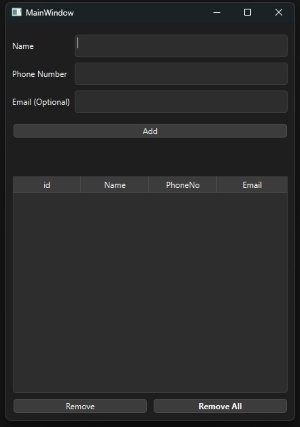

# Contact Manager Application

## 1. Project Overview

Developing a simple contact manager application, that contains different functionality for personal use.

## 2. Features

* **Add Contact:**
    * User enters name, phone number, and email address.
    * System validates input data.
    * New contact is added to the contact list.

* **Edit Contact:**
    * User selects a contact from the list.
    * User can modify contact information.
    * System updates the contact information. 

* **Delete Contact:**
    * User can delete select and delete single/multiple contacts.
    * User can delete all contact in the contact list.

* **Add Contact to Favorites:**
    * User can add a single/multiple users to favorites

* **Search Through Contacts:**
    * User can search through contact details
    * User can filter by favorites

## 3. User Interface

* **Main Window:**
    * A form for contact details (name,phone and email)
    * Add Button (To add contact to contact list)
    * Contacts List (Containing all contacts)
    * Search bar
    * Search button
    * Reset search button
    * Remove button (To remove selected contacts)
    * Remove all button (To remove all contact)

## 4. Use Cases

* **UC1: Add a New Contact**
    1. User fills up form details
    2. User clicks "Add"
    3. System checks data validity
    4. System adds a new contact to the contacts list

* **UC2: Remove Contact**
    1. User select row(s)
    2. User clicks "Remove"
    3. System remove contact from the contacts list

* **UC2: Remove All Contacts**
    1. User clicks "Remove All"
    2. System empty out the contacts list